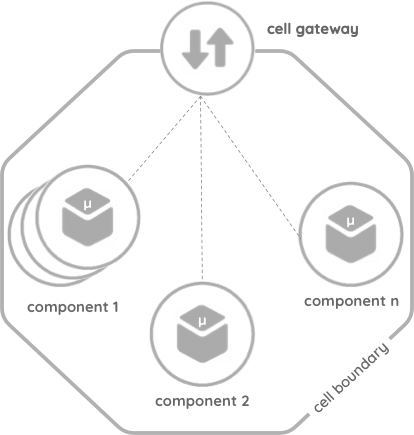
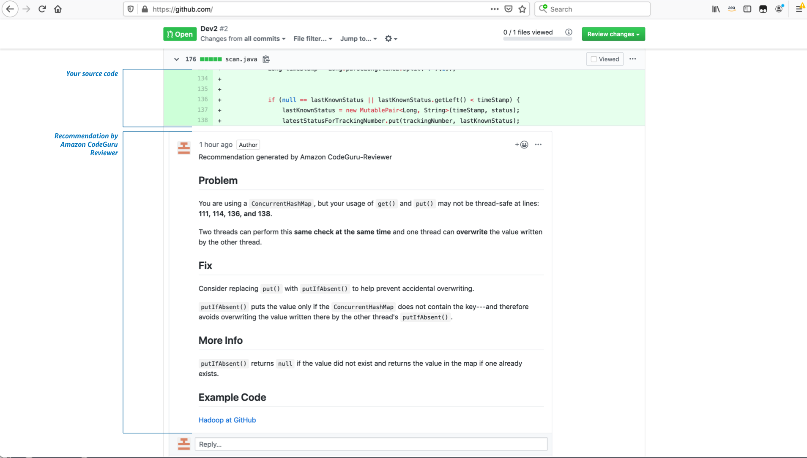

<section data-background="images/reinvent.jpg">

Las Vegas Report
 
re:Cap for NTT Data 2019.12.18
 
 
 
 
 
 
</section>

---

### 自己紹介

<ul>
  

  <li style="margin: 10px 0px 10px">名前：川畑 光平</li>
  <li style="margin: 10px 0px 10px">所属：デジタル技術部アジャイルプロフェッショナルセンタ</li>
  <li style="margin: 10px 0px 10px">今の仕事：プロジェクト支援(主にクラウド系)とR&amp;D</li>
  <li style="margin: 10px 0px 10px">これまでの仕事
    <ul>
      <li>某金融機関IBアプリケーション開発(投資信託業務)</li>
      <li>某金融社団法人システム基盤開発</li>
      <li>TERASOLUNA/自動化ツール開発</li>
      <li>プロジェクト支援多数(AP基盤/アーキテクト)</li>
    </ul>
  </li>
  <li style="margin: 10px 0px 10px">Technical background
    <ul>
      <li>シニアITスペリャリスト(ソフトウェアアーキテクチャ)</li>
      <li>TERASOLUNA認定アーキテクト</li>
      <li>Pivotal certified Spring Professional</li>
      <li>Redhat certified engineers</li>
      <li>AWS Solution Architect Professional</li>
    </ul>
  </li>
  <li style="margin: 10px 0px 10px"><a href="https://aws.amazon.com/jp/partners/ambassadors/?cards-body.sort-by=item.additionalFields.ambassadorName&cards-body.sort-order=asc&awsm.page-cards-body=1&cards-body.q=Kawabata&cards-body.q_operator=AND" target="_blank">2019 APN AWS Top Engineers &amp; Ambassadors</a></li>
  <li style="margin: 10px 0px 10px">マイナビ「ITSearch+」で記事連載中</li>
  

</ul>

***

re:Invent My Schedule 

---

Today's Topic 

***

<section data-background-video="https://debugroom-sample.s3-ap-northeast-1.amazonaws.com/keynote.mov" data-background-video-loop data-background-video-muted data-background-opacity="1">
  

    <h2>Keynote Hall</h2>
    <a href="https://youtu.be/OdzaTbaQwTg?t=2421" target="_blank">VENETIAN HALL A</a>
  

</section>

***

Cell-based Architectures 

---

Cell-based Architectures - Reducing blast radius(爆発半径：障害影響の範囲) -

出典：「Cell-Based Architecture」（Asanka Abeysinghe | Deputy CTO & VP of Architecture | Paul Fremantle | CTO and Co-Founder - CTO Office | WSO2, Inc）： <a href="https://github.com/wso2/reference-architecture/blob/master/reference-architecture-cell-based.md" target="_blank">wso2/reference-architecture</a>

---

Cell-based Architectures - Beyond MicroService -

<ul>
  <li style="margin: 10px 0px 10px">セルは単一ないしは幾つかのマイクロサービスアプリケーション、サーバレスアプリケーション・データストアなどのコンポーネント(データプレーン)で構成される</li>
  <li style="margin: 10px 0px 10px">セルはメッセージキューやESB、REST APIなどのゲートウェイをもつ(コントロールプレーン)</li>
  <li style="margin: 10px 0px 10px">セルにはレガシーシステムなど巨大なコンポーネントの集まりも指す場合もある</li>
  <li style="margin: 10px 0px 10px">セルはアジャイル開発を行うチームが、CI/CD等によって自動化された開発プロセス、デプロイ、リリースサイクルを最適化される単位である</li>
  <li style="margin: 10px 0px 10px">セルはDomainDrivenDevelopmentで言えば、「境界づけられたコンテキスト」の単位で相互に独立しており、スケーラビリティを有する</li>
</ul>

---

Cell-based Architectures をインターネットバンキングの例で考えてみよう

---

Cell-based Architecturesをインターネットバンキングの例で考えてみよう 

---

<section data-background="images/cell-based-architecture-session-1.jpg">
Cell-based Architectures(MicroService)がもたらすもの

 

  <table>
    <thead>
      <tr>
        <th>Pros</th>
        <th>Cons</th>
      </tr>
    </thead>
    <tbody>
      <tr>
        <td>アベイラビリティ(耐障害性)</td>
        <td>データ一貫性の低下</td>
      </tr>
      <tr>
        <td>柔軟なスケーラビリティ</td>
        <td>複雑性</td>
      </tr>
      <tr>
        <td>開発のアジリティ</td>
        <td></td>
      </tr>
    </tbody>
  </table>

 

</section>

---

Cell-based Architectures Session

  
障害の影響範囲の極小化に向け、AWSでCell-based Architecturesを如何に実現するか

---

Cell-based Architectures Session

---

Conclusion

Cell-based Architecturesは当社の抱える ラージスケールなアプリケーションアーキテクチャやレガシーデジタルインテグレーションの課題解決に向けた1つの指針となる

***

<section data-background-video="https://debugroom-sample.s3-ap-northeast-1.amazonaws.com/lambda-for-java.mov" data-background-video-loop data-background-video-muted data-background-opacity="1">
  

    <h2>Session</h2>
    <a href="https://youtu.be/ddg1u5HLwg8?t=0" target="_blank">Best Practice for AWS Lambda and Java</a>
  

</section>

***

Session : Best practice AWS Lambda for Java 

---

Conclusion : Best practice AWS Lambda for Java 

***

<section data-background-video="https://debugroom-sample.s3-ap-northeast-1.amazonaws.com/ambassadors-meetup.mov" data-background-video-loop data-background-video-muted data-background-opacity="1">
  

    Ambassadors Meetup  
    <a href="https://aws.amazon.com/jp/partners/ambassadors/?cards-body.sort-by=item.additionalFields.ambassadorName&cards-body.sort-order=asc&awsm.page-cards-body=3&awsf.apn-ambassadors-location=*all" target="_blank">What is Ambassador?</a>
  

</section>

***

Impressive New Service

---

Amazon CodeGuru Reviewer

---

Amazon CodeGuru Profiler

---

Conclusion

当社が好きそう

***
***

Next Action : 塾開設
CloudNative/MicroService On AWSを中心としたテーマで検証・知見/ノウハウを外部公開

  <table>
    <thead>
      <tr>
        <th>Category</th>
        <th>テーマ</th>
      </tr>
    </thead>
    <tbody>
      <tr>
        <td rowspan="5">マイクロサービスアーキテクチャ</td>
        <td>Cell-Based Architecture on AWS の検証</td>
      </tr>
      <tr>
        <td>サービス連携処理パターンの検証(オーケストレーション/コレオグラフィ/SAGAパターン等)</td>
      </tr>
      <tr>
        <td>ドメイン駆動設計におけるマイクロサービスモデリング手法の検証</td>
      </tr>
      <tr>
        <td>ログ出力方式ベストプラクティス(CloudWatchLogs/Fluentd/ElasticSearch/Kibana/ AWSGlue/Athena/Prometeus)</td>
      </tr>
      <tr>
        <td style="border-bottom:1px solid;">JakartaEE-MicroProfile検証</td>
      </tr>
    </tbody>
  </table>

---

  <table>
    <thead>
      <tr>
        <th>Category</th>
        <th>テーマ</th>
      </tr>
    </thead>
    <tbody>
      <tr>
        <td rowspan="7">クラウドネイティブアプリケーションデザインパターン</td>
        <td>オンライン非同期処理パターン(Spring Cloud Stream/ Amazon Managed Streaming for Kafka)</td>
      </tr>
      <tr>
        <td>クラウドバッチ処理パターン(SpringCloudAWS/AmazonSQS/AWSBatch/SpringBatch/ AWSStepFuntions)</td>
      </tr>
      <tr>
        <td>コンテナ&サーバレス連動処理パターン (AWS Lambda/AmazonElastiCache/WebSockets)</td>
      </tr>
      <tr>
        <td>マネージドサービス連携ベストプラクティス(AmazonS3/AmazonSQS/AmazonMQ/AmazonSNS)</td>
      </tr>
      <tr>
        <td>EKS/AppMesh/SpringCloudKubernetes/サービスメッシュ検証</td>
      </tr>
      <tr>
        <td style="border-bottom:1px solid;">OpenIDConnect/OAuth2/Cognito認証・認可処理パターン検証</td>
      </tr>
      <tr>
        <td style="border-bottom:1px solid;">CloudFormationを用いたアプリケーションDevOps基盤自動化資材の開発</td>
      </tr>
    </tbody>
  </table>

---

  <table>
    <thead>
      <tr>
        <th>Category</th>
        <th>テーマ</th>
      </tr>
    </thead>
    <tbody>
      <tr>
        <td rowspan="3">リアクティブプログラミング/サーバレス</td>
        <td>GraalVM/Quarkus/SpringCloudFuntion on AWS Lambda検証</td>
      </tr>
      <tr>
        <td>SpringWebFluxの特徴・実装ノウハウの整理</td>
      </tr>
      <tr>
        <td>サーバレスアーキテクチャパターンonAWSの整理</td>
      </tr>
      <tr>
        <td rowspan="4">NoSQLデータモデリング</td>
        <td>AmazonDynanoDB/ApacheCassandraService等 AP型NoSQLの特徴/運用ノウハウ/データモデリング手法確立</td>
      </tr>
      <tr>
        <td>AmazonElastiCache/SpringSession/SpringDataRedis を使ったスケラーブルアプリケーションノウハウ整理</td>
      </tr>
      <tr>
        <td>ApacheCassandraService/BigDataOnAWS(ApacheSpark/Hadoop/ ElasticMapReduce)連携検証・ノウハウ整理</td>
      </tr>
      <tr>
        <td style="border-bottom:1px solid;">教育コンテンツ整備(ChatMessageアプリケーション)</td>
      </tr>
    </tbody>
  </table>

---

  <table>
    <thead>
      <tr>
        <th>Category</th>
        <th>テーマ</th>
      </tr>
    </thead>
    <tbody>
      <tr>
        <td rowspan="8">ニュージャンル</td>
        <td>AWS IoT検証(AWS IoT Core/Device Management/ Greengrass/Analytics/FreeRTOS/SiteWise等)</td>
      </tr>
      <tr>
        <td>エッジコンピューティングアーキテクチャ on AWS検証</td>
      </tr>
      <tr>
        <td>AWS SystemsManagerエンタープライズ運用 ベストプラクティスの整理</td>
      </tr>
      <tr>
        <td>AmazonCodeGuru(コードレビュー自動化)検証</td>
      </tr>
      <tr>
        <td>AmazonSumerian(VR/AR)検証</td>
      </tr>
      <tr>
        <td>ML/AIサービス検証(Amazon SageMaker等)</td>
      </tr>
      <tr>
        <td>モバイルアプリケーション(AWS MobileHub/ Amplify/iOS/Android)教育コンテンツ整備/ アーキテクチャパターン検証・実装ノウハウの整理</td>
      </tr>
      <tr>
        <td style="border-bottom:1px solid;">Kotlin/Go/Angular/React/Python検証・実装ノウハウの整理</td>
      </tr>
    </tbody>
  </table>

---

## 塾生募集します！

***

#### ご静聴ありがとうございました :bow:

---
